# MQTT

「1つが小さい」「大量の」データを「低遅延」「双方向」通信が可能なプロトコル



## ブローカー(Broker)

MQTT ブローカーは、クライアントによって開始された接続を受信し、クライアントによって送信されたメッセージを他の適格なクライアントに転送する責任を負います。MQTT ブローカーは、大規模な接続と数百万のメッセージ スループットをサポートできるため、IoT ビジネス プロバイダーがビジネス機能に集中し、信頼性の高い MQTT アプリケーションを迅速に作成できるようになります。

+ MQTT クライアントの承認と認証
+ さらなる分析のためにメッセージを他のシステムに渡すこと
+ 受信できなかったメッセージとクライアントセッションの処理

## パブリッシャー(Publisher)

MQTT クライアントは、トピックとデータをバイト形式で含むメッセージを配信します。クライアントは、テキストデータ、バイナリデータ、XML、または JSON ファイルなどのデータ形式を決定します。\
例\
スマートホームシステムの照明は、トピック livingroom/light に対してメッセージを配信する場合があります。

## サブスクライバー(Subscriber)

MQTT クライアントは、SUBSCRIBE メッセージを MQTT ブローカーに送信して、関心のあるトピックに関するメッセージを受信します。このメッセージには、一意の識別子とサブスクリプションのリストが含まれています。
例\
スマートフォンのスマートホームアプリで、家の中で照明を点灯しているかを表示させたいとします。\
トピック light をサ定期購買し、すべてのメッセージに対するカウンターを増やします。 

# 温度・湿度配信システム

+ Broker mqtt.inlet.wjg.jp:1889
+ 接続にはクライアント認証を行わない

## トピックス

トピックス /acf/env/


## 交換データ:JSON形式

```
{
    "ID":端末ID,
	"TS": 計測日時, 
	"T": 温度(単位:摂氏度) ,　
	"H": 湿度(単位:%),　
	"I": 熱指数(単位:摂氏度),
	"D": 結露温度(単位:),
	"S": 快適度
}
```
快適度一覧
+ OK : 
+ Too Hot :
+ Too dry :
+ Hot and dry :
+ Cold and dry :
+ Too humid :
+ Hot and humid :
+ Cold and humid :
+ Unknown : 想定外の結果だった

サンプル
```
{
    "ID":"arduino_000",
	"TS": "2024/07/30 05:26:04",
	"T": 37.1,
	"H": 52,
	"I": 47.11,
	"D": 25.61,
	"S": "Comfort_TooHot"
}
```

